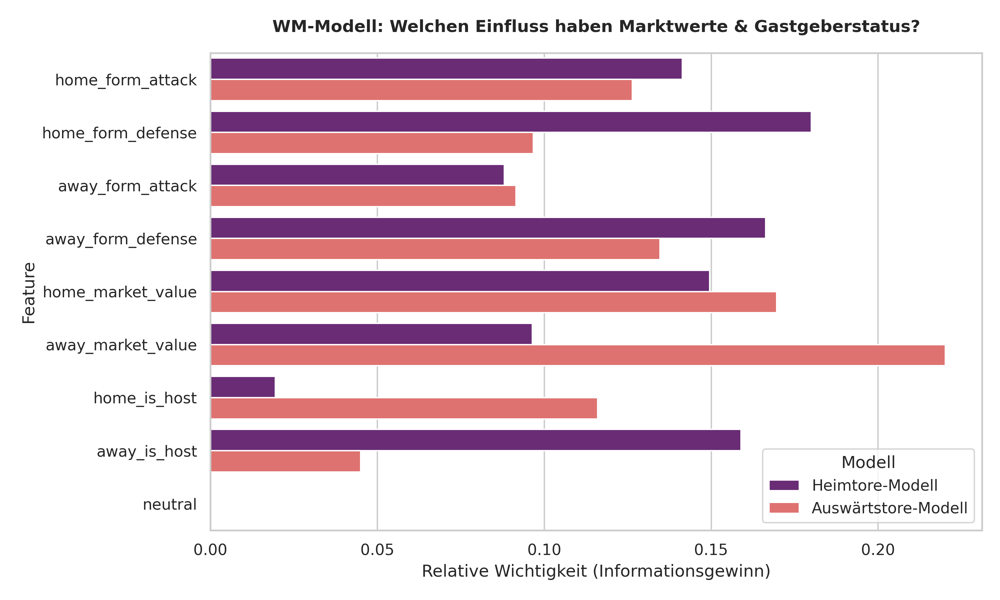
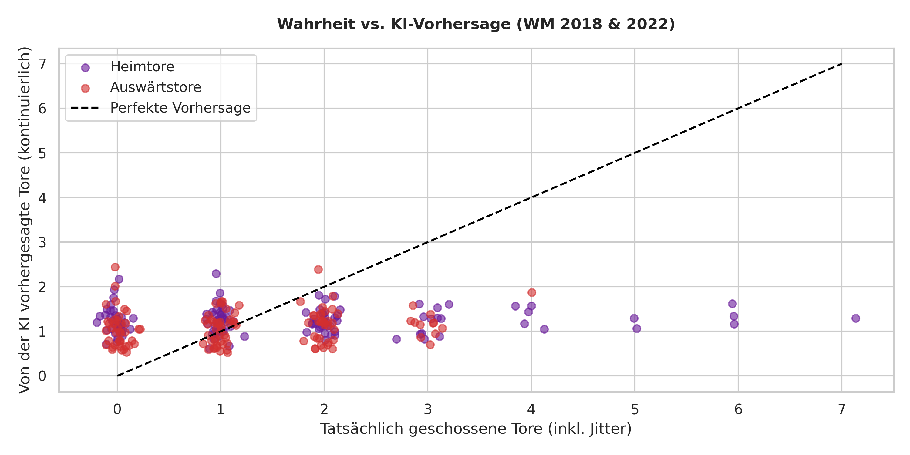
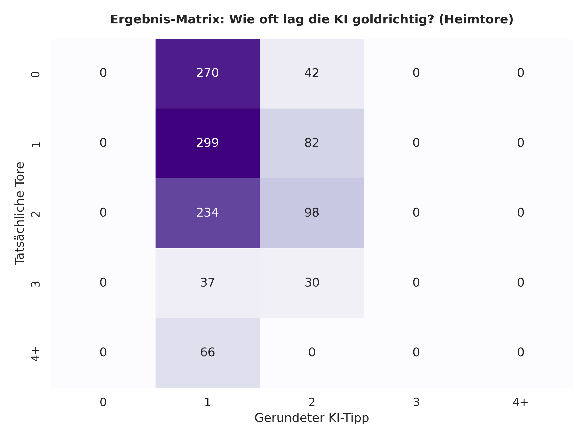
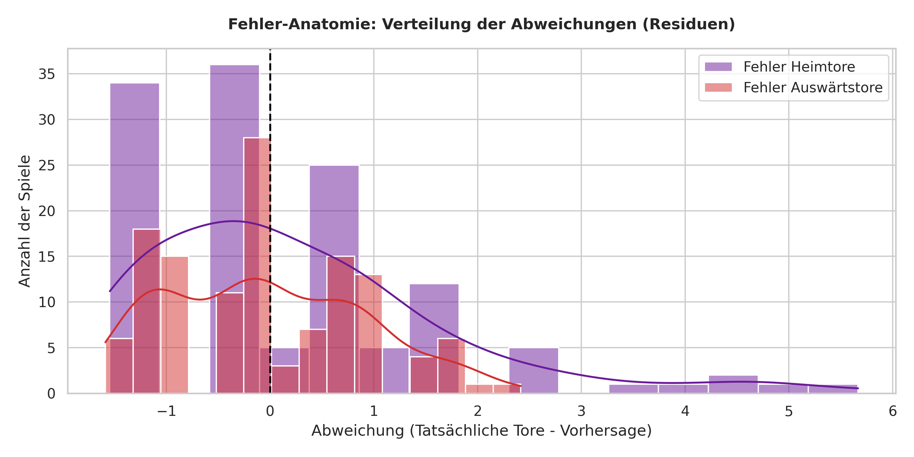

Dieses Projekt stellt eine vollständige, produktionsreife Machine-Learning-Pipeline dar, die die Tor-Ergebnisse für die FIFA Weltmeisterschaft 2026 prognostiziert. Der gesamte Code ist modular aufgebaut und gliedert sich in drei Kernphasen:

1. Data Engineering & Feature Pipeline (prepare_data.py)

    Bereinigung & Harmonisierung: Lädt historische Spielergebnisse sowie globale Marktwert-Tabellen und führt die Spuren über ein automatisches Mapping fehlerfrei zusammen.

    Zeit-Filterung: Eliminiert veraltete Taktik-Epochen (Concept Drift), indem nur moderne Spiele ab dem Jahr 2000 betrachtet werden.

    Formkurven-Berechnung: Kalkuliert dynamisch die sportliche Verfassung (Tore/Gegentore der letzten 5 Spiele) über alle Länderspiele direkt vor einem Turnier.

    Finanz-Aggregation: Sortiert Einzelspieler nach Marktwert und summiert die Top 26 Akteure zu einem realistischen Gesamt-Kaderwert pro Nation.

    Gastgeber-Injektion: Identifiziert echte WM-Ausrichter (z. B. Deutschland 2006 oder USA 2026), um den atmosphärischen Heimvorteil mathematisch greifbar zu machen.

2. Modell-Training & Validierung (train.py)

    Architektur: Trainiert zwei getrennte, hoch-regulierte XGBoost-Regressoren – eines für die Tore des nominellen Heimteams, eines für das Auswärtsteam.

    Zeitbasierter Split: Verhindert das Erschummeln von Trends (Data Leakage). Das Modell lernt ausschließlich auf den WMs 2000–2014 und wird an den für die KI völlig unbekannten Turnieren 2018 und 2022 validiert.

    Overfitting-Schutz: Durch extrem flache Entscheidungsbäume (max_depth=3) und strenge Regularisierungsstrafen wird verhindert, dass die KI statistisches Rauschen auswendig lernt. Das Modell agiert dadurch hocheffizient (Regression zur Mitte).

3. Diagnostik & Live-Inferenz (visualize.py & predict.py)

    Automatisierte Qualitätskontrolle: Erstellt bei jedem Durchlauf vier mathematische Diagnose-Plots (Feature Importance, Wahrheit vs. Vorhersage, Ergebnis-Matrix und Fehler-Anatomie) im Ordner plots/.

    WM 2026 Live-Simulator: Lädt die fertig trainierten Modelle aus der Cold-Storage-Datei (.pkl) und berechnet für jede eingegebene Paarung der kommenden WM 2026 in Sekundenbruchteilen den exakten, mathematisch wahrscheinlichsten Ergebnistipp.

#Modell-Diagnostik:

1. Feature Importance

Feature Importance (Informationsgewinn) visualisiert, welche Faktoren für die Bäume den höchsten Informationsgewinn geliefert haben.Insight: Beim Auswärtstor-Modell dominiert der Marktwert des Kaders (away_market_value) mit über 22 % Einfluss die komplette Entscheidungskette. Beim Heimtor-Modell teilen sich Formkurven und Marktwerte das Gewicht deutlich balancierter auf.

2. Wahrheit vs. KI-Vorhersage

Wahrheit vs. KI-Vorhersage (Regression zur Mitte)Plottet die tatsächlich gefallenen Tore gegen den kontinuierlichen Erwartungswert der KI (inklusive Jitter zur Dichteveranschaulichung).Insight: Das Diagramm deckt die risikoscheue Natur der KI auf. Da extreme Torfestivals (z.B. 5, 6 oder 7 Tore) statistisch seltene Ausreißer sind, weigert sich das stark regulierte Modell zu "zocken". Um den globalen Fehler (MAE) zu minimieren, tendiert es bei extremen Spielen stabil zum sicheren Erwartungswert (Regression zur Mitte).

3. Ergebnis-Matrix

Ergebnis-Matrix (Confusion Matrix)Zeigt präzise, wie oft die gerundeten Vorhersagen der KI exakt der Realität entsprachen.Insight: Das Modell meidet die extremen, volatilen Ränder (0 oder 3+ Tore) und fokussiert sich hochgradig effizient auf das statistische Epizentrum des Fußballs: das 1-Tor-Szenario. Allein hier lag die KI in 35 Fällen absolut goldrichtig.

4. Fehler-Anatomie

 Fehler-Anatomie (Residuen-Verteilung)Zeigt die statistische Verteilung der Abweichungen ($\text{Wahrheit} - \text{Vorhersage}$).Insight: Die Fehler bilden eine fast perfekte, symmetrische Glockenkurve (Normalverteilung) um die Nulllinie herum. Dies ist der mathematische Beweis, dass das Modell unvoreingenommen (unbiased) arbeitet. Es unterschätzt Mannschaften im Turnierschnitt genauso häufig, wie es sie überschätzt.

