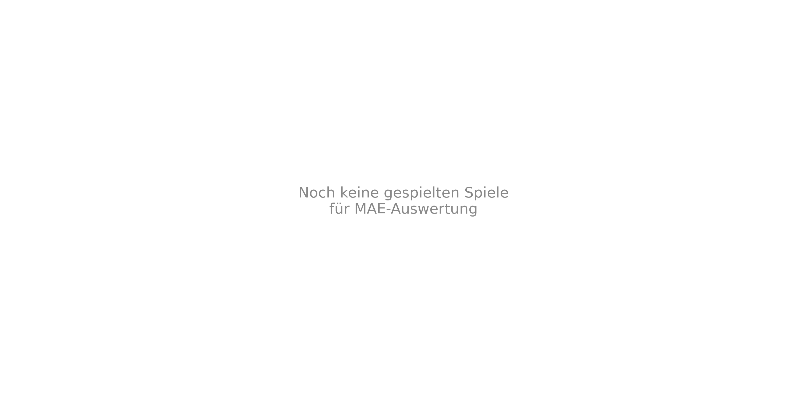
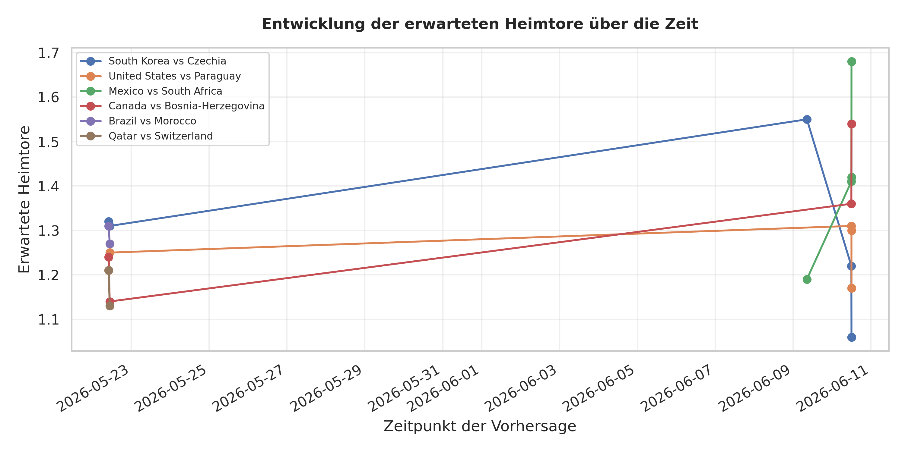

# GoalPredictionEngine

Eine end-to-end MLOps-Pipeline, die täglich Torergebnis-Prognosen für die **FIFA Weltmeisterschaft 2026** erstellt. Das System trainiert zwei XGBoost-Regressoren auf historischen WM-Daten, bezieht Live-Spielplandaten von football-data.org und liefert Vorhersagen per Telegram-Benachrichtigung und Streamlit-Dashboard. Die gesamte Pipeline läuft containerisiert und wird täglich automatisch via GitHub Actions ausgeführt.

---

## Inhaltsverzeichnis

1. [Architektur-Überblick](#architektur-überblick)
2. [Projektstruktur](#projektstruktur)
3. [Machine-Learning-Modell](#machine-learning-modell)
4. [Pipeline-Phasen](#pipeline-phasen)
5. [Lokale Einrichtung](#lokale-einrichtung)
6. [Konfiguration](#konfiguration)
7. [Pipeline ausführen](#pipeline-ausführen)
8. [Dagster (optionale lokale Orchestrierung)](#dagster-optionale-lokale-orchestrierung)
9. [CI/CD mit GitHub Actions](#cicd-mit-github-actions)
10. [Ausgaben](#ausgaben)
11. [Modell-Diagnostik](#modell-diagnostik)

---

## Architektur-Überblick

```
football-data.org API
        │
        ▼
  data_sources.py          ← Live-Spielplan abrufen (SCHEDULED / FINISHED)
        │
        ▼
  prepare_data.py          ← Bereinigung, Formkurven, Marktwert-Aggregation
        │
        ▼
    train.py               ← XGBoost trainieren (zeitbasierter Split, kein Data Leakage)
        │
        ├──► visualize.py  ← 6 Diagnose-Plots generieren
        │
        ▼
   predict.py              ← Batch-Vorhersagen für die nächsten 3 Tage
        │
        ├──► predictions.csv / prediction_history.csv
        │
        ▼
    notify.py              ← Telegram-Benachrichtigung senden
        │
        ▼
  dashboard.py             ← Streamlit-UI (read-only, zeigt CSVs an)
```

Die gesamte Kette wird täglich von `run_pipeline.py` sequenziell ausgeführt — lokal oder im Docker-Container via GitHub Actions.

---

## Projektstruktur

```
GoalPredictionEngine/
│
├── run_pipeline.py                   # Haupt-Orchestrator
├── prepare_data.py                   # Daten-Engineering & Feature-Berechnung
├── train.py                          # Modelltraining & Validierung
├── predict.py                        # Einzel- und Batch-Vorhersagen
├── visualize.py                      # Diagnose-Plots (6 Charts)
├── data_sources.py                   # football-data.org API-Client
├── notify.py                         # Telegram-Benachrichtigungen
├── dashboard.py                      # Streamlit-Dashboard
│
├── config.yaml                       # Zentrale Pfade & Hyperparameter
├── requirements.txt                  # Vollständige Dev-Abhängigkeiten
├── requirements-pipeline.txt         # Minimale Docker-Abhängigkeiten (10 Pakete)
├── Dockerfile                        # Container-Image für die Pipeline
├── .env                              # Lokale Secrets (nicht committed)
│
├── .github/
│   └── workflows/
│       └── daily_pipeline.yml        # GitHub Actions (täglich 05:00 UTC)
│
├── data/
│   ├── raw/
│   │   ├── matches_1930_2022.csv     # Historische WM-Ergebnisse (1930–2022)
│   │   ├── wm_dataset.csv            # Kaderwerte & Turnierstatistiken pro Nation (48 Teams)
│   │   ├── fifa_player_performance_market_value.csv  # Spieler-Marktwerte (mit Positionsdaten)
│   │   └── wm2026_live.csv           # Live-Daten (täglich überschrieben)
│   └── processed/
│       ├── cleaned_wm_data.csv       # Bereinigte Daten mit berechneten Features
│       ├── predictions.csv           # Aktuelle Vorhersagen (3-Tage-Fenster)
│       └── prediction_history.csv    # Alle bisherigen Vorhersagen mit Zeitstempel
│
├── models/
│   ├── wm_home_goals_model.pkl       # Trainiertes XGBoost-Modell (Heimtore)
│   └── wm_away_goals_model.pkl       # Trainiertes XGBoost-Modell (Auswärtstore)
│
├── plots/                            # Werden bei jedem Pipeline-Lauf neu generiert
│   ├── 1_feature_importance.png
│   ├── 2_actual_vs_predicted.png
│   ├── 3_ergebnis_matrix.png
│   ├── 4_fehler_anatomie.png
│   ├── 5_mae_over_time.png
│   └── 6_prediction_evolution.png
│
└── wm_pipeline/                      # Dagster-Assets (optionale lokale Orchestrierung)
    ├── __init__.py                   # Dagster Definitions (Assets, Sensor, Job)
    ├── assets.py                     # Asset-Implementierungen
    └── data_sources.py               # API-Client (auch standalone nutzbar)
```

---

## Machine-Learning-Modell

### Architektur

Zwei separate **XGBoost-Regressoren** — einer für Heim-, einer für Auswärtstore — werden unabhängig voneinander trainiert. Das ermöglicht asymmetrische Vorhersagen (z.B. klarer Favoritensieg) ohne gegenseitige Einschränkung.

### Features (9 Eingangssignale)

| Feature | Beschreibung |
|---|---|
| `home_form_attack` | Ø Tore (Heim) aus den letzten 5 Spielen |
| `away_form_attack` | Ø Tore (Auswärts) aus den letzten 5 Spielen |
| `home_form_defense` | Ø Gegentore (Heim) aus den letzten 5 Spielen |
| `away_form_defense` | Ø Gegentore (Auswärts) aus den letzten 5 Spielen |
| `home_market_value` | Aggregierter Kaderwert Heimteam (Mio. EUR) |
| `away_market_value` | Aggregierter Kaderwert Auswärtsteam (Mio. EUR) |
| `home_is_host` | 1 wenn das Heimteam Gastgeber der WM ist |
| `away_is_host` | 1 wenn das Auswärtsteam Gastgeber der WM ist |
| `neutral` | Immer 1 (WM-Spiele finden auf neutralem Boden statt) |

### Hyperparameter

```yaml
n_estimators:      120
learning_rate:     0.02
max_depth:         3        # Flache Bäume verhindern Overfitting
reg_alpha:         1.5      # L1-Regularisierung
reg_lambda:        1.5      # L2-Regularisierung
subsample:         0.7      # Stochastisches Boosting
colsample_bytree:  0.7
```

### Zeitbasierter Split (kein Data Leakage)

| Split | Daten | Zweck |
|---|---|---|
| Training | WMs 2000–2014 | Modell lernt hier |
| Test | WMs 2018 & 2022 | Echter Holdout — dem Modell völlig unbekannt |

Ältere Spiele werden durch **exponentiellen Gewichtungsabfall** (λ = 0.15) abgewertet, um Concept Drift zu berücksichtigen — taktische Stile und Spielstärken ändern sich über Jahrzehnte. Der Wert wurde per Ablation-Test bestätigt.

**Typischer MAE auf dem Testset:** ~0.85–0.95 Tore pro Team.

---

## Pipeline-Phasen

### 1. `data_sources.py` — Live-Daten abrufen

Ruft die football-data.org API mit dem `FOOTBALL_DATA_TOKEN` ab und speichert alle WM-2026-Spiele in `data/raw/wm2026_live.csv`. Spiele mit Status `FINISHED` fließen später in das Training ein; `TIMED`-Spiele sind die Vorhersage-Kandidaten.

### 2. `prepare_data.py` — Daten-Engineering

- **Bereinigung & Harmonisierung:** Ländernamen werden normalisiert (z.B. `"DR Congo"` → `"Congo DR"`), verschiedene CSV-Spaltenschemata werden auf ein einheitliches Format gemappt.
- **`merge_live_data()`:** Fügt abgeschlossene Live-Spiele dem historischen Datensatz hinzu. Fehlende Datei und leere Datei werden beide sauber abgefangen.
- **Formkurven:** Für jedes Team werden Ø-Tore und Ø-Gegentore der letzten 5 WM-Spiele berechnet (Rolling Window, vor dem jeweiligen Spiel).
- **Marktwert-Aggregation:** Liest den aggregierten Kaderwert pro Nation aus `wm_dataset.csv` (bereits pro Team summiert, in Mio. €). Median-Fallback für Teams ohne Eintrag.
- **Gastgeber-Injektion:** Setzt `home_is_host = 1` / `away_is_host = 1` für die WM-2026-Gastgeber USA, Kanada und Mexiko.

### 3. `train.py` — Modelltraining

Trainiert beide XGBoost-Modelle mit Time-Decay-Gewichtung, evaluiert sie auf dem Holdout-Set (2018 & 2022) und speichert die Modelle als `.pkl`-Dateien in `models/`.

### 4. `visualize.py` — Diagnose-Plots

Erstellt sechs Plots in `plots/` (Beschreibung im Abschnitt [Modell-Diagnostik](#modell-diagnostik)). Die Plots werden bei jedem Pipeline-Lauf neu generiert — die im Repo committeten Bilder entsprechen dem Stand des letzten erfolgreichen Laufs.

### 5. `predict.py` — Vorhersagen

**Einzelvorhersage (CLI):**
```bash
python predict.py 'Germany' 'France'
# → Germany 2 : 1 France  (pred: 1.87 – 1.34)
```

**Batch-Vorhersage:** Alle `TIMED`-Spiele innerhalb der nächsten 3 Tage (konfigurierbar über `prediction_window_days`). Ergebnisse landen in `predictions.csv` und `prediction_history.csv`.

### 6. `notify.py` — Telegram

Formatiert die aktuellen Vorhersagen als Telegram-Nachricht (HTML-Modus, mit Flaggen-Emojis) und sendet sie an den konfigurierten Chat. Kein Versand, wenn keine Spiele im Fenster liegen.

---

## Lokale Einrichtung

### Voraussetzungen

- Python 3.11+
- Docker (optional, für Container-Betrieb)

### 1. Repository klonen

```bash
git clone https://github.com/sauterjoshua/GoalPredictionEngine.git
cd GoalPredictionEngine
```

### 2. Virtuelle Umgebung & Abhängigkeiten

```bash
python -m venv .venv
source .venv/bin/activate          # Fish: source .venv/bin/activate.fish
                                   # Windows: .venv\Scripts\activate
pip install -r requirements.txt
```

### 3. Secrets konfigurieren

`.env`-Datei im Projektroot anlegen:

```env
FOOTBALL_DATA_TOKEN=<dein-token>       # https://www.football-data.org (kostenlos)
TELEGRAM_BOT_TOKEN=<dein-bot-token>    # via @BotFather auf Telegram
TELEGRAM_CHAT_ID=<deine-chat-id>       # Deine Telegram-Chat-ID (Zahl)
```

### 4. Docker-Build (optional)

```bash
docker build -t goalpredictionengine .

docker run --rm \
  --env-file .env \
  -v "$(pwd)/data/raw/wm2026_live.csv:/app/data/raw/wm2026_live.csv" \
  -v "$(pwd)/data/processed:/app/data/processed" \
  goalpredictionengine
```

---

## Konfiguration

Alle Pfade und Modell-Parameter sind in `config.yaml` zentralisiert:

```yaml
selected_tournament: "world_cup"

tournaments:
  world_cup:
    raw_path:          "data/raw/matches_1930_2022.csv"
    processed_path:    "data/processed/cleaned_wm_data.csv"
    live_path:         "data/raw/wm2026_live.csv"
    predictions_path:  "data/processed/predictions.csv"
    history_path:      "data/processed/prediction_history.csv"

model:
  decay_rate: 0.15                    # Exponentieller Zeitabfall im Training

prediction:
  prediction_window_days: 3           # Vorhersage-Horizont in Tagen
```

---

## Pipeline ausführen

### Vollständige Pipeline

```bash
python run_pipeline.py
```

Führt sequenziell aus: Live-Daten abrufen → Daten vorbereiten → Modell trainieren → Plots erstellen → Vorhersagen berechnen → Telegram senden.

### Einzelne Module

```bash
python prepare_data.py               # Nur Daten aufbereiten
python train.py                      # Nur Modell trainieren
python predict.py 'Brazil' 'Mexico'  # Einzelvorhersage
python notify.py                     # Nur Telegram-Nachricht senden
streamlit run dashboard.py           # Dashboard starten
```

---

## Dagster (optionale lokale Orchestrierung)

Das Verzeichnis `wm_pipeline/` enthält eine vollständige **Dagster**-Implementierung der gleichen Pipeline als Alternative zu `run_pipeline.py`. Dagster bietet eine Web-UI zur Visualisierung von Asset-Abhängigkeiten, Lauf-Historien und Logs.

### Wann Dagster, wann `run_pipeline.py`?

| Szenario | Empfehlung |
|---|---|
| GitHub Actions / CI | `run_pipeline.py` (kein Dagster-Daemon nötig) |
| Lokale Entwicklung mit UI | Dagster (`dg dev`) |
| Debugging einzelner Assets | Dagster (selektive Materialisierung) |

### Dagster lokal starten

```bash
cd GoalPredictionEngine
dg dev
# → Dagster-UI unter http://localhost:3000
```

Der **Sensor** `new_finished_matches_sensor` pollt alle 5 Minuten die API und triggert automatisch einen neuen Lauf, sobald ein Spiel auf `FINISHED` wechselt. Im CI-Betrieb (GitHub Actions) übernimmt der tägliche Cron-Job diese Rolle.

---

## CI/CD mit GitHub Actions

Die Pipeline läuft täglich vollautomatisch via `.github/workflows/daily_pipeline.yml`.

### Trigger

- **Täglich 05:00 UTC** (07:00 CEST / 06:00 CET) per Cron
- **Manuell** über den "Run workflow"-Button in der GitHub UI

### Workflow-Schritte

| Schritt | Aktion |
|---|---|
| 1. Checkout | Repo mit vollständiger History holen (`fetch-depth: 0`) |
| 2. Docker Buildx | BuildKit mit GHA-Layer-Cache einrichten |
| 3. ghcr.io Login | Authentifizierung bei GitHub Container Registry |
| 4. Image bauen & pushen | `:latest` + `:run-{run_id}` Tags, pip-Layer gecacht |
| 5. Seed-Dateien | `wm2026_live.csv` und CSV-Header sicherstellen |
| 6. Pipeline starten | Container mit Secrets und selektiven Bind-Mounts ausführen |
| 7. Commit-back | Geänderte CSVs committen und auf `main` pushen |

### Bind-Mounts im Container

```
data/raw/wm2026_live.csv   ↔  /app/data/raw/wm2026_live.csv   (Live-Daten)
data/processed/            ↔  /app/data/processed/             (Vorhersagen)
```

Die historischen Trainingsdaten (`matches_1930_2022.csv`, `wm_dataset.csv`) sind im Image eingebettet (`COPY . .`) — kein Mount nötig.

### Benötigte GitHub Secrets

| Secret | Beschreibung |
|---|---|
| `FOOTBALL_DATA_TOKEN` | API-Key von football-data.org |
| `TELEGRAM_BOT_TOKEN` | Bot-Token von @BotFather |
| `TELEGRAM_CHAT_ID` | Ziel-Chat-ID für Benachrichtigungen |

---

## Ausgaben

### `data/processed/predictions.csv`

Aktuelle Vorhersagen für das 3-Tage-Fenster ab heute.

```
date,home_team,away_team,pred_home_goals,pred_away_goals,tipp_home,tipp_away,...
2026-06-15,Germany,France,1.87,1.34,2,1,...
```

### `data/processed/prediction_history.csv`

Kumulativer Log aller Vorhersagen mit Zeitstempel und `match_key` (`{date}_{home_team}_{away_team}`). Dient der Nachverfolgung, wie sich Vorhersagen im Turnierverlauf verändern. Wird nur aktualisiert, wenn sich die exakten Tor-Erwartungswerte gegenüber dem letzten Eintrag geändert haben (kein Duplikat-Logging).

### Telegram-Nachricht

Täglich wird eine formatierte Übersicht der kommenden Spiele mit Toretipps an den konfigurierten Chat gesendet. Wenn keine Spiele im Fenster liegen, wird nichts gesendet.

### Streamlit-Dashboard

```bash
streamlit run dashboard.py
```

Zeigt `predictions.csv` und `prediction_history.csv` interaktiv an. Zwei Ansichten: aktuelles 3-Tage-Fenster und durchblätterbare Historie nach Spieltag.

---

## Modell-Diagnostik

> Die Plots werden bei jedem Pipeline-Lauf neu generiert. Die hier eingebetteten Bilder zeigen den Stand des letzten commits.

### 1. Feature Importance


Beim **Auswärtstor-Modell** dominiert `away_market_value` mit über 22 % Einfluss. Beim **Heimtor-Modell** teilen sich Formkurven und Marktwerte das Gewicht deutlich balancierter.

### 2. Wahrheit vs. KI-Vorhersage (Regression zur Mitte)


Das stark regularisierte Modell "zockt" nicht auf seltene Torfestivals. Da Ergebnisse mit 5+ Toren statistische Ausreißer sind, minimiert das Modell den globalen MAE durch Regression zum Erwartungswert — ein bekanntes Verhalten regulierter Regressoren auf kleinen Datensätzen.

### 3. Ergebnis-Matrix


Das Modell fokussiert sich auf das statistische Epizentrum des Fußballs: das 1-Tor-Szenario. Die Modell-Präzision ist dort am höchsten.

### 4. Fehler-Anatomie (Residuen)


Die Residuen bilden eine symmetrische Verteilung um die Nulllinie — Zeichen eines unvoreingenommenen (unbiased) Modells ohne systematischen Over- oder Underestimation-Bias.

### 5. MAE im Turnierverlauf



Zeigt den kumulierten mittleren absoluten Fehler, sobald echte WM-2026-Ergebnisse vorliegen. Füllt sich im Turnierverlauf automatisch.

### 6. Vorhersage-Evolution



Verfolgt, wie sich die Tipp-Werte einzelner Spiele über die Zeit verschieben — z.B. wenn neue Formkurven-Daten durch gespielte Gruppenspiele einfließen.